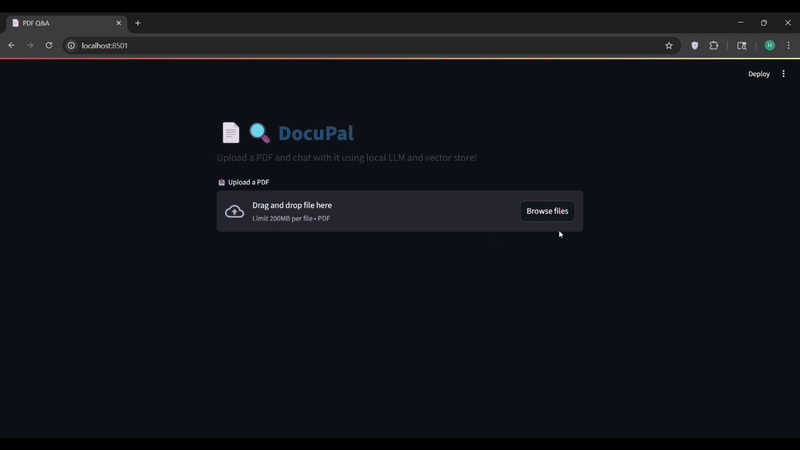

# 🧠 DocuPal — Intelligent PDF Assistant using Ollama & Streamlit



> A private, intelligent PDF chatbot that allows users to upload any document and ask questions about its content in natural language. Powered by **Ollama**, **LangChain**, **ChromaDB**, and **Streamlit**.

---

## 🚀 Features

- 📝 Upload any PDF
- 💬 Ask questions and get answers from the file contents
- 🧠 LLM-powered via Ollama (local model)
- 🔎 Contextual RAG using ChromaDB
- 💡 Fast and lightweight UI with Streamlit

---

## ⚙️ Setup Instructions

### 📦 Option 1: Using Docker (Recommended)

> Docker image includes everything: Ollama + Streamlit + dependencies.

1. **Install Docker**: [Get Docker](https://www.docker.com/products/docker-desktop/)

2. **Clone the Repo**:
```
git clone https://github.com/HarishSingaravelan/DocuPal.git
cd DocuPal
```

3. **Create the image from Dockerfile**
```
docker build -t ollama-chat .
```
4. **Create a container with mounted volumes** (to persist Ollama models across runs and avoid re-downloading them each time the container starts)

```
docker run -v ollama-data:/root/.ollama -p 8501:8501 ollama-chat
```
> You can access streamlit via [localhost:8501](http://localhost:8501/)

### ⚒️ Option 2: Manual Setup (No Docker)
Make sure you have Python 3.9+, Ollama installed locally, and dependencies ready.

1. Install Ollama locally: https://ollama.com

2. Pull a supported model:
```
ollama pull llama3.2 mxbai-embed-large
```
3. Clone the repo:
```
git clone https://github.com/HarishSingaravelan/DocuPal.git
cd DocuPal
```
4. Create and activate a virtual environment:
```
python -m venv venv
source venv/bin/activate  # On Windows: venv\Scripts\activate
```
5. Install dependencies:
```
pip install -r requirements.txt
```
6. Run the Streamlit app:
```
streamlit run app.py
```

## 🧪 Tech Stack
- 🧠 Ollama (local LLM inference)

- 🔍 LangChain

- 🗃️ ChromaDB (in-memory vector store or persistent volume)

- 🐍 Python

- 🌐 Streamlit (UI)

- 📄 PyMuPDF (fitz) for PDF parsing

## 🧱 Project Structure
```
├── app.py              # Main Streamlit app
├── rag_utils.py        # PDF parsing & Chroma logic
├── ollama_chat.py      # Querying Ollama with LangChain
├── Dockerfile          # Docker config
├── requirements.txt
└── README.md
```

## 📌 Future Improvements
- Multi-file support

- Summary generation

- UI themes & dark mode

- Model selection toggle (Mistral, Phi-3, Llama3, etc.)

- Live citation highlighting

- File upload history per session

## 💬 Feedback & Contributions
Have ideas or found bugs? Feel free to open an issue or pull request!


