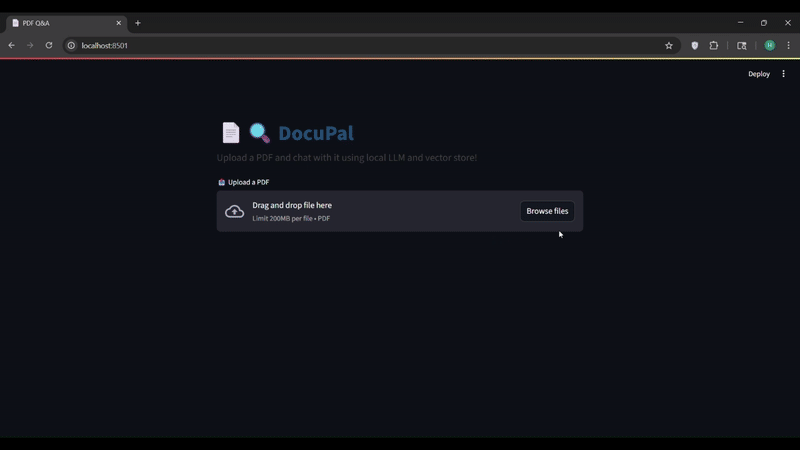

# 🧠 DocuPal — Intelligent PDF Assistant using Ollama & Streamlit



> A private, intelligent PDF chatbot that allows users to upload any document and ask questions about its content in natural language. Powered by **Ollama**, **LangChain**, **ChromaDB**, and **Streamlit**.

---

## 🚀 Features

- 📝 Upload any PDF
- 💬 Ask questions and get answers from the file contents
- 🧠 LLM-powered via Ollama (local model)
- 🔎 Contextual RAG using ChromaDB
- 💡 Fast and lightweight UI with Streamlit

## 🧪 Tech Stack
- 🧠 Ollama (local LLM inference)

- 🔍 LangChain

- 🗃️ ChromaDB (in-memory vector store or persistent volume)

- 🐍 Python

- 🌐 Streamlit (UI)

- 📄 PyMuPDF (fitz) for PDF parsing

## 1. Folder structure
 
Ensure all files are saved in the same folder. Your project directory should look exactly like this:
 
```
/docupal-project
├── Dockerfile
├── requirements.txt
├── entrypoint.sh
├── utils.py
├── agent.py
├── api.py
└── app.py
```
 
---
 
## 2. Build the Docker Image
 
Open your terminal, navigate to your project folder, and run the following command to build the image, tagged as `docupal-agent`:
 
```bash
docker build -t docupal-agent .
```
 
> **Note:** Don't forget the period `.` at the end — it tells Docker to look in the current directory.
 
---
 
## 3. Run the Container
 
Once the build finishes, start the container. This maps all three ports (FastAPI, Streamlit, and Ollama) to your local machine:
 
```bash
docker run -d -p 8000:8000 -p 8501:8501 -p 11434:11434 --name docupal-running docupal-agent
```
 
---
 
## 4. Monitor the Startup Process
 
> ⚠️ **Important:** The `entrypoint.sh` script downloads `llama3.2` and `nomic-embed-text` on container start. The app will **not** be instantly available.
 
Watch the logs to track model downloads and server startup:
 
```bash
docker logs -f docupal-running
```
 
Wait until you see the **Uvicorn (FastAPI)** and **Streamlit** startup success messages in the terminal. Press `Ctrl+C` to exit the log view once ready.
 
---
 
## 5. Access Your Application
 
Once fully booted, open the following in your browser:
 
| Layer | URL | Description |
|---|---|---|
| Streamlit Frontend | http://localhost:8501 | The main user interface |
| FastAPI Backend | http://localhost:8000/docs | Auto-generated Swagger UI for testing endpoints |
 
---
 
## Useful Commands
 
### Stop the application
```bash
docker stop docupal-running
```
 
### Rebuild after code changes
```bash
docker rm docupal-running
docker build -t docupal-agent .
docker run -d -p 8000:8000 -p 8501:8501 -p 11434:11434 --name docupal-running docupal-agent
```

### Delete the container:
This deletes the container and the heavy LLM weights stored inside it.
```bash
docker rm docupal-running
```

### Delete the image you built:
This removes the docupal-agent image from your system.

```bash
docker rmi docupal-agent
```

### The "Deep Clean" (Highly Recommended):
Docker caches a lot of intermediate build layers and dangling images. To wipe all unused containers, networks, images (including the base ollama/ollama image if no other containers are using it), and build cache, run a system prune:

```bash
docker system prune -a --volumes
```

